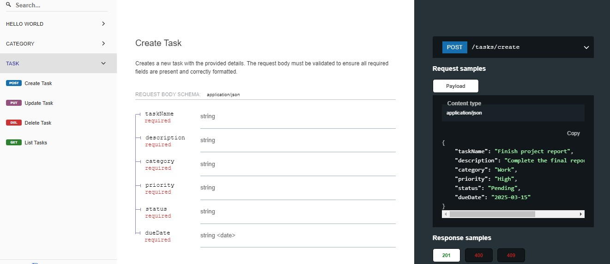
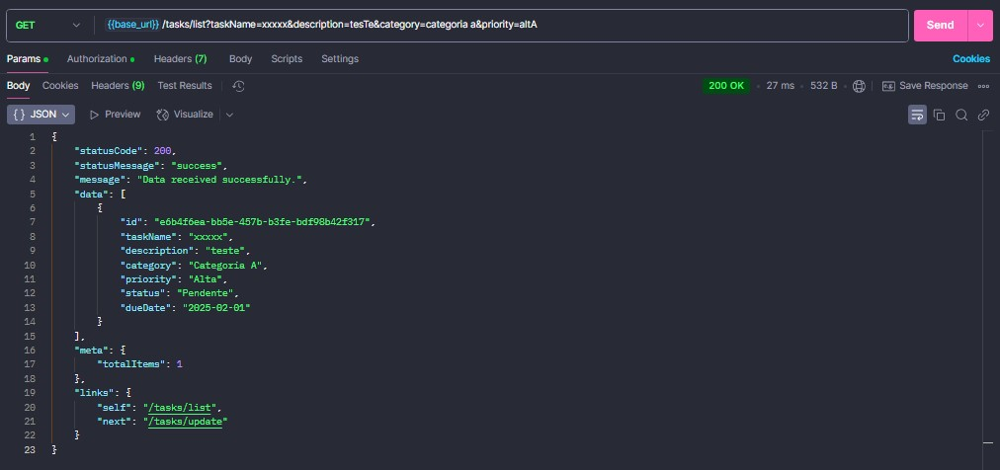
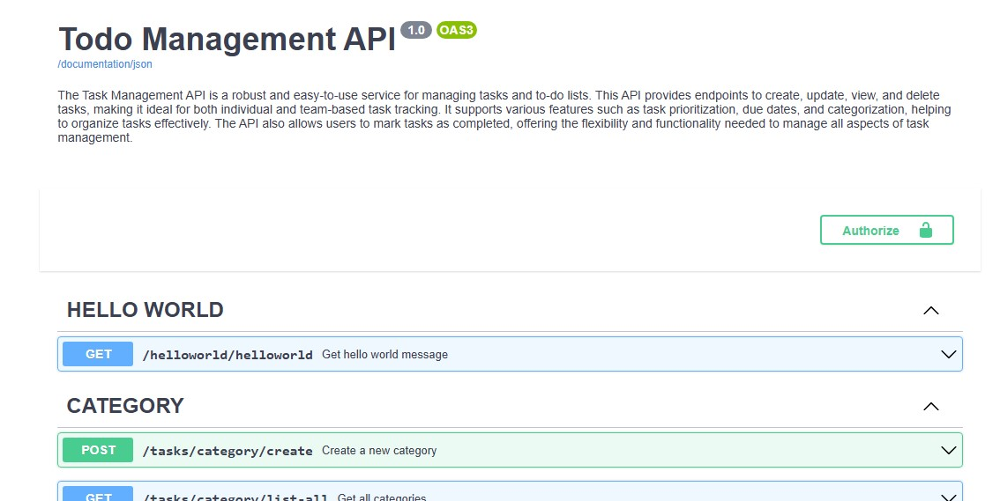

# Task Management API

The **Task Management API** is a robust and easy-to-use service for managing tasks and to-do lists. This API provides endpoints to create, update, view, and delete tasks, making it ideal for both individual and team-based task tracking. It supports various features such as task prioritization, due dates, and categorization, helping to organize tasks effectively. The API also allows users to mark tasks as completed, offering the flexibility and functionality needed to manage all aspects of task management.

## Features

- Task CRUD operations (Create, Read, Update, Delete)
- Task categorization and prioritization
- Task status management (Pending, Completed, etc.)
- Due dates for task deadlines
- Server-side internationalization (multiple language support)
- Validation of input fields
- Error handling and logging
- API documentation with **Swagger** and **Redocly**
- Database migration with **Flyway**
- Microservices architecture using **Spring Boot**
- Postgres database support
- **Docker** support for containerization
- **NGINX** API Gateway for routing and load balancing

 
   
   
   

## Technologies

- **Java** - Programming language
- **Spring** - Framework for building the application
- **Hibernate** - ORM for database operations
- **Flyway** - Database migration tool
- **Lombok** - Reduces boilerplate code (Getters, Setters, etc.)
- **API Gateway (NGINX)** - For routing API requests and load balancing
- **Microservices** - Modular architecture for easier scalability and maintenance
- **PostgreSQL** - Relational database management system
- **Logs** - For logging application activities
- **Error Handler** - Custom error handling for API responses
- **Swagger & Redocly** - API documentation tools
- **Inputs Validation** - Input validation using annotations like `@NotBlank`, `@Pattern`, etc.
- **Docker** - Containerization of the application
- **Internationalization** - Translation support (server-side)

## Requirements

- **Java 17** or above
- **Docker**
- **PostgreSQL** (or any relational database supported by Hibernate)

